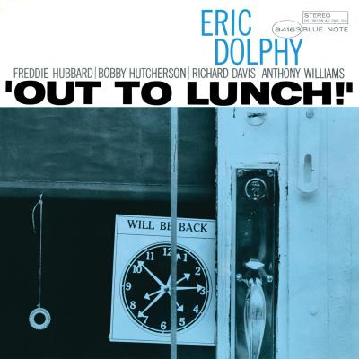

## Stephen Malito's Portfolio

### Design

I wanted my site to have a bit of the feel of my musical passion. Therefore, the Full Width design and dimensions are aimed at creating a website which looks like the cover of an LP vs your standard Website. The Style and Feel is an homage to the consistently amazing artworks that grace the covers of releases from Blue Note Records. I have always loved this album in particular. It's simple, yet impactful design is outshadowed only by the wizardry of the recording itself. Eric Dolphy's, Avant Garde Masterpiece, Out To Lunch. 

#### Usability

The single page with simple design was chosen specifically for ease of use and 0 navigation. The Nav bar is used only as a holding pattern for external resources. 
